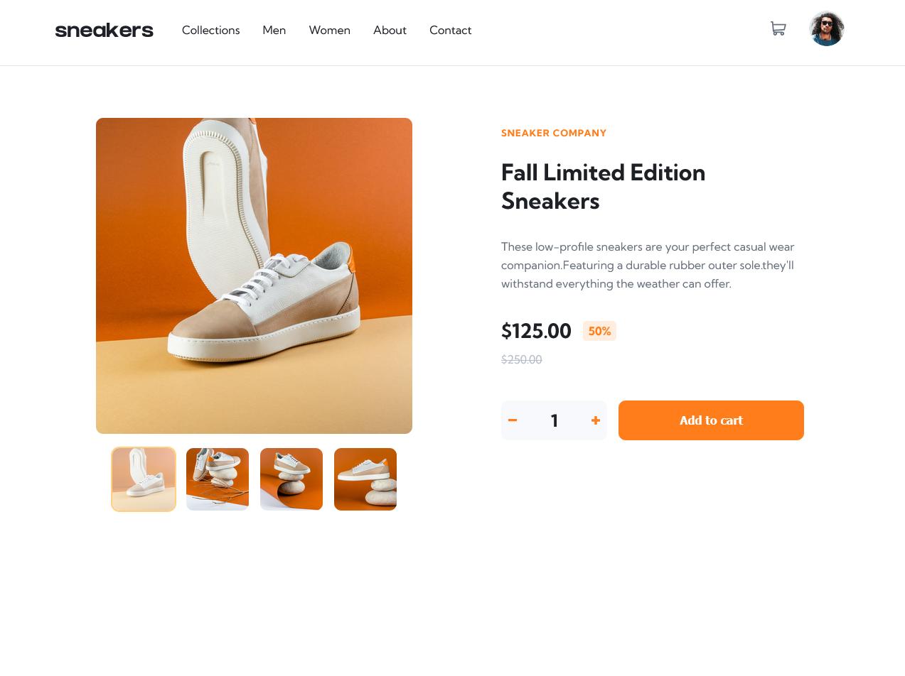

# Frontend Mentor - E-commerce product page solution

This is a solution to the [E-commerce product page challenge on Frontend Mentor](https://www.frontendmentor.io/challenges/ecommerce-product-page-UPsZ9MJp6). Frontend Mentor challenges help you improve your coding skills by building realistic projects.

## Table of contents

- [Overview](#overview)
  - [The challenge](#the-challenge)
  - [Screenshot](#screenshot)
  - [Links](#links)
- [My process](#my-process)
  - [Built with](#built-with)
  - [What I learned](#what-i-learned)
  - [Continued development](#continued-development)
  - [Useful resources](#useful-resources)
- [Author](#author)

## Overview

### The challenge

Users should be able to:

- View the optimal layout for the site depending on their device's screen size
- See hover states for all interactive elements on the page
- Open a lightbox gallery by clicking on the large product image
- Switch the large product image by clicking on the small thumbnail images
- Add items to the cart
- View the cart and remove items from it

### Screenshot

### Links

- Solution URL: [Github](https://github.com/nas22663/E-Commerce-V1-FullStack/tree/master/Client)
- Live Site URL: [LiveSite](https://nas22663.github.io/E-Commerce-V1-FullStack/Client/html/product-details.html)

## My process

- built backend apis first there .. most are not used then started on frontend was not so hard with the help of chat gpt since its been a while since i done frontend

### Built with

- Semantic HTML5 markup
- CSS custom properties
- Flexbox
- CSS Grid
- NodeJs

### What I learned

it's a mess right .. i have just learned express node js and wanted to try to somewhat integerate them both frontend (css,html,js) and backend (nodejs) its not dynamic for sure but i will keep working on a landing page and try to make it fully functional hopefully
so backend apis are in server folder and frontend are in client folder
i really had trouble deploying the project so i ended up uploading backend on vercel and frontend on github 100% there is an easier way :D will try to look this stuff up more.

### Continued development

want to learn more about deployment of fullstack apps and deployment in general if anyone have any advice for me going forward please let me know
i want to also learn react to be a MERN developer

### Useful resources

had a lot of help from chatgpt building the frontend since i haven't done any css and dom related js in a while

## Author

- Frontend Mentor - [@yourusername](https://www.frontendmentor.io/profile/nas22663)
